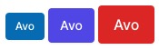

# Class variants

We ❤️ Tailwind CSS but sometimes it's difficult to manage the state of some elements using conditionals. `class_variants` is a tiny helper that should enable you to create, configure, and apply different variants of elements as classes.

Inspired by [variant-classnames](https://github.com/mattvalleycodes/variant-classnames) ✌️

## Quicklinks

* [DRY up your tailwind CSS using this awesome gem](https://www.youtube.com/watch?v=cFcwNH6x77g)

## Installation

Add this line to your application's Gemfile:

```ruby
gem 'class_variants'
```

And then execute:

```
$ bundle
```

Or install it yourself as:

```
$ gem install class_variants
```

## Usage

We create an object from the class or helper where we define the configuration using four arguments:

1. The `base` keyword argument with default classes that should be applied to each variant.
2. The `variants` keyword argument where we declare the variants with their option and classes.
3. The `compound_variants` keyword argument where we declare the compound variants with their conditions and classes
4. The `defaults` keyword argument (optional) where we declare the default value for each variant.

Below we'll implement the [button component](https://tailwindui.com/components/application-ui/elements/buttons) from Tailwind UI.

```ruby
# Define the variants and defaults
button_classes = ClassVariants.build(
  base: "inline-flex items-center rounded border border-transparent font-medium text-white hover:text-white shadow-sm focus:outline-none focus:ring-2 focus:ring-offset-2",
  variants: {
    color: {
      indigo: "bg-indigo-600 hover:bg-indigo-700 focus:ring-indigo-500",
      red: "bg-red-600 hover:bg-red-700 focus:ring-red-500",
      blue: "bg-blue-600 hover:bg-blue-700 focus:ring-blue-500",
    },
    size: {
      sm: "px-2.5 py-1.5 text-xs",
      md: "px-3 py-2 text-sm",
      lg: "px-4 py-2 text-sm",
      xl: "px-4 py-2 text-base",
    },
    compound_variants: [
      { color: :red,  border: true, class: "border-red-800"  },
      { color: :blue, border: true, class: "border-blue-800" }
    ]
    # A variant whose value is a string will be expanded into a hash that looks
    # like  { true => "classes" }
    icon: "w-full justify-center",
    # Unless the key starts with !, in which case it will expand into
    # { false => "classes" }
    "!icon": "w-auto",
  },
  defaults: {
    size: :md,
    color: :indigo,
    icon: false
  }
)

# Call it with our desired variants
button_classes.render(color: :blue, size: :sm)
button_classes.render
button_classes.render(color: :red, size: :xl, icon: true)
```

## Compound Variants

```ruby
button_classes = ClassVariants.build(
  base: "inline-flex items-center rounded",
  variants: {
    color: {
      red:  "bg-red-600",
      blue: "bg-blue-600",
    },
    border: "border"
  },
  compound_variants: [
    { color: :red,  border: true, class: "border-red-800"  },
    { color: :blue, border: true, class: "border-blue-800" }
  ]
)

button_classes.render(color: :red) # => "inline-flex items-center rounded bg-red-600"
button_classes.render(color: :red, border: true) # => "inline-flex items-center rounded bg-red-600 border border-red-600"
```

## Override classes with `render`

We can also override the builder classes in the `render` method.

```ruby
button_classes = ClassVariants.build(
  base: "inline-flex items-center rounded",
  variants: { ... },
)

button_classes.render(color: :red, class: "block")
```

Now, the `block` class will be appended to the classes bus.

If you're using the [`tailwind_merge`](#tailwind_merge) plugin it will override the `inline-flex` class.

## Block configurations

You might have scenarios where you have more advanced conditionals and you'd like to configure the classes using the block notation.

```ruby
alert_classes = ClassVariants.build do
  # base
  base "..."

  # variant
  variant color: :red, class: "..."

  # compound variant
  variant type: :button, color: :red, class: "..."

  # defaults
  defaults color: :red, type: :button
end

# usage
alert_classes.render(color: :red, type: :button)
```

## Slots

You might have components which have multiple slots or places where you'd like to use conditional classes.
`class_variants` supports that through slots.

```ruby
# Example

alert_classes = ClassVariants.build do
  # base with slots
  base do
    slot :head, class: "..."
    slot :body, class: "..."
  end

  # variant with slots
  variant color: :red do
    slot :head, class: "..."
    slot :body, class: "..."
  end

  # compound variant with slots
  variant type: :button, color: :red do
    slot :head, class: "..."
    slot :body, class: "..."
  end

  # set defaults
  defaults color: :red, type: :button
end
```

```erb
<div>
  <div class="<%= alert_classes.render(:head) %>">
    Head of alert
  </div>
  <div class="<%= alert_classes.render(:body) %>">
    Body of alert
  </div>
</div>
```

## Merge definitions

```ruby
alert_classes = ClassVariants.build(base: "bg-white")
alert_classes.merge(base: "text-black")
alert_classes.render # => "bg-white text-black"
```

## Full API

```ruby
# Configuration
alert_classes = ClassVariants.build(
  base: "...",
  variants: {
    color: {
      red: "...",
      black: "..."
    },
    type: {
      button: "...",
      link: "..."
    }
  },
  compound_variants: [],
  defaults: {
    color: :red,
    type: :button
  }
) do
  # base without slots
  base "..."

  # base with slots
  base do
    slot :head, class: "..."
    slot :body, class: "..."
  end

  # variant without slots
  variant color: :red, class: "..."

  # variant with slots
  variant color: :red do
    slot :head, class: "..."
    slot :body, class: "..."
  end

  # compound variant without slots
  variant type: :button, color: :red, class: "..."

  # compound variant with slots
  variant type: :button, color: :red do
    slot :head, class: "..."
    slot :body, class: "..."
  end

  # option 1 (my favorite)
  defaults color: :red, type: :button

  # option 2
  defaults do
    color :red
    type :button
  end
end

# Usage

# renders the defaults
alert_classes.render

# render default slot with custom variants
alert_classes.render(color: :red)

# render slot with defaults variants
alert_classes.render(:body)

# render slot with custom variants
alert_classes.render(:body, color: :red)

# if slot not exist, throw error? return empty classes?
alert_classes.render(:non_existent_slot, color: :red)

# render default slot with custom class (will be merged)
alert_classes.render(class: "...")

# render slot with custom class (will be merged)
alert_classes.render(:body, class: "...")
```

## Use with Rails

```ruby
# Somewhere in your helpers
def button_classes(classes = "", **args)
  ClassVariants.build(
    base: "inline-flex items-center rounded border border-transparent font-medium text-white hover:text-white shadow-sm focus:outline-none focus:ring-2 focus:ring-offset-2",
    variants: {
      size: {
        sm: "px-2.5 py-1.5 text-xs",
        md: "px-3 py-2 text-sm",
        lg: "px-4 py-2 text-sm",
        xl: "px-4 py-2 text-base"
      },
      color: {
        indigo: "bg-indigo-600 hover:bg-indigo-700 focus:ring-indigo-500",
        red: "bg-red-600 hover:bg-red-700 focus:ring-red-500",
        blue: "bg-blue-600 hover:bg-blue-700 focus:ring-blue-500"
      }
    },
    compound_variants: [],
    defaults: {
      size: :md,
      color: :indigo
    }
  )
end
```

```erb
<!-- In your views -->
<%= link_to :Avo, "https://avohq.io", class: button_classes.render(color: :blue, size: :sm) %>
<%= link_to :Avo, "https://avohq.io", class: button_classes.render %>
<%= link_to :Avo, "https://avohq.io", class: button_classes.render(color: :red, size: :xl) %>
```

### Output

### 

## Helper module

If you're developing something more complex you might want to use composition more. You might want to use the helper module for that.

```ruby
class MyClass
  include ClassVariants::Helper

  class_variants(
    base: "bg-white",
    variants: {
      color: {
        red: "text-red",
        blue: "text-blue"
      }
    }
  )
end

MyClass.new.class_variants(color: :red, class: "shadow") # => "bg-white text-red shadow"
```

This helper supports class inheritance, so that the subclass receives a copy of the class_variants config that the parent class had at the time of inheritance. From that point on, the settings are kept separate for both. Successive calls to class_variants helper method, will cause the configuration to be merged.

```ruby
class A
  include ClassVariants::Helper

  class_variants(base: "bg-red")
end

class B < A
  class_variants(base: "text-black")
end

A.class_variants(base: "text-white")

A.new.class_variants # => "bg-red text-white"
B.new.class_variants # => "bg-red text-black"
```

## `tailwind_merge`

By default, the classes are merged using `concat`, but you can use the awesome [TailwindMerge](https://github.com/gjtorikian/tailwind_merge) gem.
Install the gem using `bundle add tailwind_merge` and use this configuration to enable it. If you're using Rails, you can put this in an initializer.

```ruby
ClassVariants.configure do |config|
  config.process_classes_with do |classes|
    TailwindMerge::Merger.new.merge(classes)
  end
end
```

## Other packages

- [`active_storage-blurhash`](https://github.com/avo-hq/active_storage-blurhash) - A plug-n-play [blurhash](https://blurha.sh/) integration for images stored in ActiveStorage
- [`avo`](https://github.com/avo-hq/avo) - Build Content management systems with Ruby on Rails
- [`prop_initializer`](https://github.com/avo-hq/prop_initializer) - A flexible tool for defining properties on Ruby classes.
- [`stimulus-confetti`](https://github.com/avo-hq/stimulus-confetti) - The easiest way to add confetti to your StimulusJS app

## Try Avo ⭐️

If you enjoyed this gem try out [Avo](https://github.com/avo-hq/avo). It helps developers build Internal Tools, Admin Panels, CMSes, CRMs, and any other type of Business Apps 10x faster on top of Ruby on Rails.

[](https://github.com/avo-hq/avo)

## Contributing

1. Fork it `git clone https://github.com/avo-hq/class_variants`
2. Create your feature branch `git checkout -b my-new-feature`
3. Commit your changes `git commit -am 'Add some feature'`
4. Push to the branch `git push origin my-new-feature`
5. Create new Pull Request

## License

This package is available as open source under the terms of the MIT License.

## Cutting a release

```bash
# Build
gem build class_variants.gemspec -o latest.gem
# Publish
gem push --host https://rubygems.org/ ./latest.gem
# Cut a tag
git tag v0.0.6 -a -m "Version 0.0.6"
# Push tag to repo
git push --follow-tags
# Go to the repo and generate release from tag
```
